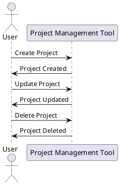

<link rel="stylesheet" type="text/css" href="../style.css">
#PM-Tool shell file

# Define the main-system and sub-system

The `main-system` and `sub-system` directories will contain different parts of your project. Here is a brief overview of each:

## Main-system
The `main-system` will contain the core functionality of your project. This could include the main server logic, database connections, and primary routes.

### Dependencies for main-system
- `express`: For handling HTTP requests and responses.
- `mongoose`: For interacting with MongoDB.
- `dotenv`: For managing environment variables.

## Sub-system
The `sub-system` will contain auxiliary or supporting functionality. This could include utility functions, middleware, or additional services.

### Dependencies for sub-system
- `axios`: For making HTTP requests to external APIs.
- `winston`: For logging.
- `jsonwebtoken`: For handling JSON Web Tokens (JWT) for authentication.

# Create a new directory for your project and set up the environment
```sh
mkdir PM-Tool
cd PM-Tool

# Initialize a new Node.js project
npm init -y

# Install Express
npm install express

# Create a basic server file
touch index.js
```

# Create main-system and sub-system directories
```sh
mkdir main-system
mkdir sub-system
```

# Add frameworks to the project
To enhance your project, you can add the following frameworks:

### Frontend Frameworks
- `react`: A JavaScript library for building user interfaces.
- `vue`: A progressive framework for building user interfaces.

### Backend Frameworks
- `nestjs`: A progressive Node.js framework for building efficient, reliable, and scalable server-side applications.
- `koa`: A new web framework designed by the team behind Express.

### Project Management Tools
- `BRM`: Benefits Realization Management.
- `CPM`: Critical Path Method.
- `CCPM`: Critical Chain Project Management.
- `EVM`: Earned Value Management.
- `Iterative and Incremental Project Management`: A method of breaking down the project into smaller segments.
- `Agile Project Management`: A methodology based on iterative development.
- `Dynamic Systems Development Method`: An agile project delivery framework.
- `Extreme Project Management`: A method for managing complex and uncertain projects.
- `Innovation Engineering`: A framework for accelerating innovation.

# Automate the setup with a script
Create a file named `setup.sh` with the following content:
```sh
#!/bin/bash

# Create a new directory for your project
mkdir PM-Tool
cd PM-Tool

# Initialize a new Node.js project
npm init -y

# Install Express
npm install express

# Create a basic server file
touch index.js

# Create main-system and sub-system directories
mkdir main-system
mkdir sub-system

# Install additional frameworks
npm install react vue @nestjs/core koa
```

# Run the script
```sh
chmod +x setup.sh
./setup.sh
```

# Project Management Process Groups
Project management involves several process groups. Here are the key process groups and how they integrate with the main-system and sub-system:

## Initiating
This phase involves defining the project at a broad level. It includes creating a project charter and identifying stakeholders.
- **Main-system**: Set up the initial server and database connections.
- **Sub-system**: Identify necessary utility functions and middleware.

### Script for Initiating
Create a file named `initiate.sh` with the following content:
```sh
#!/bin/bash

# Set up initial server and database connections for main-system
cd main-system
touch server.js
echo "const express = require('express');" >> server.js
echo "const mongoose = require('mongoose');" >> server.js
echo "require('dotenv').config();" >> server.js

# Identify necessary utility functions and middleware for sub-system
cd ../sub-system
touch utils.js
echo "// Utility functions go here" >> utils.js
touch middleware.js
echo "// Middleware functions go here" >> middleware.js
```

## Planning
In this phase, detailed planning is done to guide the project team. It includes defining the scope, setting objectives, and developing a project management plan.
- **Main-system**: Plan the core functionalities and primary routes.
- **Sub-system**: Plan the auxiliary services and additional functionalities.

### Script for Planning
Create a file named `plan.sh` with the following content:
```sh
#!/bin/bash

# Plan core functionalities and primary routes for main-system
cd main-system
touch routes.js
echo "// Define primary routes here" >> routes.js

# Plan auxiliary services and additional functionalities for sub-system
cd ../sub-system
touch services.js
echo "// Define auxiliary services here" >> services.js
```

## Executing
This phase involves coordinating people and resources to carry out the project plan. It includes managing teams, quality assurance, and communication.
- **Main-system**: Implement the server logic, database interactions, and primary routes.
- **Sub-system**: Develop and integrate utility functions, middleware, and additional services.

### Script for Executing
Create a file named `execute.sh` with the following content:
```sh
#!/bin/bash

# Implement server logic, database interactions, and primary routes for main-system
cd main-system
echo "const app = express();" >> server.js
echo "mongoose.connect(process.env.DB_URI);" >> server.js
echo "app.use('/', require('./routes'));" >> server.js

# Develop and integrate utility functions, middleware, and additional services for sub-system
cd ../sub-system
echo "module.exports = { /* utility functions */ };" >> utils.js
echo "module.exports = { /* middleware functions */ };" >> middleware.js
```

## Monitoring and Controlling
This phase involves tracking, reviewing, and regulating the progress and performance of the project. It includes managing changes and ensuring that project objectives are met.
- **Main-system**: Monitor server performance and database interactions.
- **Sub-system**: Track the performance of utility functions and middleware.

### Script for Monitoring and Controlling
Create a file named `monitor.sh` with the following content:
```sh
#!/bin/bash

# Monitor server performance and database interactions for main-system
cd main-system
touch monitor.js
echo "const winston = require('winston');" >> monitor.js
echo "// Monitoring logic here" >> monitor.js

# Track performance of utility functions and middleware for sub-system
cd ../sub-system
touch performance.js
echo "// Performance tracking logic here" >> performance.js
```

## Closing
This phase involves finalizing all project activities. It includes handing over deliverables, releasing project resources, and obtaining stakeholder approval.
- **Main-system**: Finalize server setup and ensure all core functionalities are working.
- **Sub-system**: Ensure all auxiliary services are integrated and functioning properly.

### Script for Closing
Create a file named `close.sh` with the following content:
```sh
#!/bin/bash

# Finalize server setup and ensure all core functionalities are working for main-system
cd main-system
echo "// Finalize server setup" >> server.js

# Ensure all auxiliary services are integrated and functioning properly for sub-system
cd ../sub-system
echo "// Finalize auxiliary services" >> services.js
```

# Interconnection Scripts
To ensure smooth transitions between process groups, create the following interconnection scripts:

### Script for Transition from Initiating to Planning
Create a file named `initiate_to_plan.sh` with the following content:
```sh
#!/bin/bash

# Transition from Initiating to Planning
./initiate.sh
./plan.sh
```

### Script for Transition from Planning to Executing
Create a file named `plan_to_execute.sh` with the following content:
```sh
#!/bin/bash

# Transition from Planning to Executing
./plan.sh
./execute.sh
```

### Script for Transition from Executing to Monitoring and Controlling
Create a file named `execute_to_monitor.sh` with the following content:
```sh
#!/bin/bash

# Transition from Executing to Monitoring and Controlling
./execute.sh
./monitor.sh
```

### Script for Transition from Monitoring and Controlling to Closing
Create a file named `monitor_to_close.sh` with the following content:
```sh
#!/bin/bash

# Transition from Monitoring and Controlling to Closing
./monitor.sh
./close.sh
```

# Project Proposal
## Idea Behind Project
The project aims to develop a comprehensive project management tool that integrates chaos engineering principles to enhance system resilience.

## Overall Goal
To create a robust project management tool that helps teams manage projects efficiently while ensuring system reliability through chaos engineering.

## Duration
The project is expected to be completed within 6 months.

# Project Scope
## Project Direction and Track
The project will focus on developing core project management functionalities, integrating chaos engineering practices, and ensuring user-friendly interfaces.

# Product Breakdown Structure (PBS)
A hierarchy of deliverables/outcomes and components thereof:
- Project Management Tool
    - Core Functionalities
        - Task Management
        - Resource Allocation
    - Chaos Engineering Integration
        - Fault Injection
        - Resilience Testing
    - User Interface
        - Dashboard
        - Reporting

# Work Breakdown Structure (WBS)
A hierarchy of the work to be done, down to daily tasks:
- Initiation
    - Define Project Charter
    - Identify Stakeholders
- Planning
    - Develop Project Plan
    - Define Scope
- Execution
    - Implement Core Functionalities
    - Integrate Chaos Engineering
- Monitoring and Controlling
    - Track Progress
    - Manage Changes
- Closing
    - Finalize Deliverables
    - Obtain Approval

# Responsibility Assignment Matrix (RACI)
Roles and responsibilities aligned to deliverables/outcomes:
- **Responsible**: Team Members
- **Accountable**: Project Manager
- **Consulted**: Subject Matter Experts
- **Informed**: Stakeholders

# Tentative Project Schedule
Milestones, important dates, deadlines:
- Month 1: Project Initiation
- Month 2-3: Planning and Design
- Month 4-5: Development and Integration
- Month 6: Testing and Deployment

# Analysis of Business Needs and Requirements
Against measurable goals:
- Improve project management efficiency by 30%
- Enhance system resilience through chaos engineering

# Review of Current Operations
Assess current project management tools and identify gaps.

# Financial Analysis of Costs and Benefits
Including a budget:
- Estimated Budget: $100,000
- Expected Benefits: Improved efficiency, reduced downtime

# Stakeholder Analysis
Including users and support personnel for the project:
- Users: Project Managers, Team Members
- Support Personnel: IT Support, Developers

# Project Charter
Including costs, tasks, deliverables, and schedules:
- Costs: $100,000
- Tasks: Defined in WBS
- Deliverables: Project Management Tool
- Schedule: 6 months

# SWOT Analysis
Strengths, weaknesses, opportunities, and threats to the business to enhance the project management tool:
- **Strengths**: Experienced team, innovative approach
- **Weaknesses**: Limited budget, tight schedule
- **Opportunities**: Market demand for resilient tools
- **Threats**: Competition, technological challenges

# Automated Interactive Live Update Visuals

To add automated interactive live update visuals for the charts and tables, you can use PlantUML. Below are examples of how to integrate PlantUML diagrams into your markdown file.

## Example PlantUML Diagram



## Example PlantUML Gantt Chart

```plantuml
@startgantt
Project starts 2025-03-01
[Initiation] lasts 1 month
[Planning] lasts 2 months
[Execution] lasts 2 months
[Monitoring and Controlling] lasts 1 month
[Closing] lasts 1 month
@endgantt
```

To view these diagrams, you can use a PlantUML viewer or integrate PlantUML with your markdown editor. For live updates, consider using a web-based PlantUML server.

# Integrating Apache Airflow for Project Management Automation

Apache Airflow is a powerful tool for automating workflows and managing tasks. By integrating Airflow into your project management tool, you can automate various project management tasks and ensure that they are executed in a timely and efficient manner.

## Sample DAG for Project Management Updates

Below is a sample Directed Acyclic Graph (DAG) for automating project management updates using Apache Airflow:

```python
from airflow import DAG
from airflow.operators.python import PythonOperator
from datetime import datetime

# Define a Python function for the task
def update_project_data():
    print("Project data updated successfully!")

# Define the DAG
default_args = {
    'owner': 'airflow',
    'depends_on_past': False,
    'email_on_failure': False,
    'email_on_retry': False,
    'retries': 1,
}

with DAG(
    dag_id='project_management_updates',
    default_args=default_args,
    description='Automates project management updates',
    schedule_interval='@daily',
    start_date=datetime(2023, 1, 1),
    catchup=False,
    tags=['project', 'management'],
) as dag:

    # Define a task
    update_task = PythonOperator(
        task_id='update_project_data',
        python_callable=update_project_data,
    )

    # Set task dependencies (if needed)
    update_task
```

This sample DAG defines a simple workflow that updates project data daily. You can customize the DAG to include additional tasks and dependencies based on your project management needs.

For more information on Apache Airflow, refer to the [official documentation](https://airflow.apache.org/docs/).
